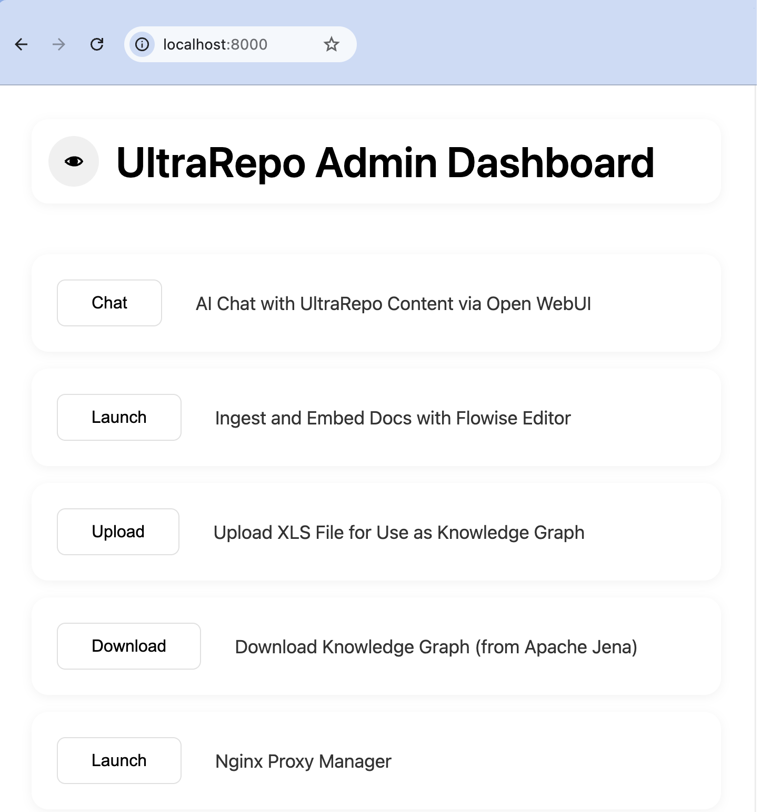

# UltraKG  🗺️ 

**Ultra Knowledge Graph (UltraKG)** is a modular, cloud-agnostic, open-source Knowledge Graph (KG) system designed specifically for use with enterprise private AI systems.

Unlike most AI platforms that rely heavily on probabilistic and intelligent 'guessing' at your intent (and often suffer from hallucination, inaccuracy and inconsistent responses), UltraKG is designed to provide AI systems with a map to your actual data for higher accuracy.  This fact based AI approach leverages **curated classification schemas** — known as **Knowledge Graphs** — to create a structured, machine-readable map that enables AI systems to reason with higher accuracy, consistency, and reliability.

Recent research and real-world testing confirm that **Knowledge Graph–based Retrieval-Augmented Generation (GraphRAG)** systems deliver significantly greater precision than standard RAG pipelines.

UltraKG enhances reasoning capabilities further with **Neurosymbolic Reasoning (NSR)** — a hybrid approach that connects symbolic knowledge (e.g., OWL2/RDF graphs or XLS spreadsheets) with vector embeddings and structured metadata. This creates a powerful, AI-readable network that links documents, data, code, APIs, and files to a **vector database**, which is also mapped to SQL objects and other knowledge graphs.

This symbolic + vector hybrid architecture enables **semantic querying and intelligent retrieval** ideally suited for enterprise-grade use cases — such as regulatory intelligence, clinical research, knowledge management, and more — where accuracy, consistency, and reliability are paramount.

UltraKG includes **GraphRAG and OmniRAG** pipelines. Content ingestion and embedding is provided via [Flowise](https://github.com/FlowiseAI/Flowise), and is built on open standards including **OWL2**, **RDF**, **SPARQL**, **PostgreSQL**, and **PGVector**. It runs on **any cloud** or **on-prem infrastructure** using Docker.

---

## 🚀 Features

- 🧠 **Apache Jena + Fuseki** SPARQL server for OWL2/RDF querying
- 🐘 **PostgreSQL + PGVector** for vector search and hybrid AI queries
- 🔄 **LangChain (via Flowise)** for document ingestion + RAG agents
- 💬 **Open WebUI** for local/private AI chatbot interface
- 📄 **XLS to OWL2 Conversion** using ProtegeProject’s `mapping-master`
- 🌐 **FastAPI Landing Page** with admin interface via Nginx Proxy Manager
- ☁️ **Cloud-agnostic Docker deployment** (Azure, AWS, GCP, on-prem)

---

## 🌐 Network Architecture

```plaintext
[Internet]
   ↓
[Nginx Proxy Manager]
   ↓
[FastAPI via Uvicorn]
```

For more info on how to configure Nginx for incoming connections:

[Network Config](config.md)

---

## ⚙️ Quick Start (MacOS Silicon + Linux)

### 1. Prerequisites

- [Docker Desktop](https://www.docker.com/products/docker-desktop/)
- Python 3.12+
- Optional: `brew install make git`

---

### 2. Clone the repo

```bash
git clone https://github.com/UltraRepo/UltraKG.git
cd UltraKG
```

---

### 3. Create your environment file

```bash
cp .env.example .env
```

Edit `.env` to customize secrets and ports. **Do not upload `.env` to GitHub.**

---

### 4. Install Python dependencies (before running Docker)

```bash
cd frontend/app
pip install -r requirements.txt
cd ../../
```

---

### 5. Run the full Docker stack

```bash
docker-compose up --build
```

This will start:
- PostgreSQL + PGVector
- Apache Jena + Fuseki
- Flowise (LangChain UI)
- Open WebUI (LLM chat)
- FastAPI server
- NGINX Proxy Manager

---

## 🔐 Default Login for NGINX Proxy Manager

Once the stack is running, go to:

```
http://localhost:81
```

**Default credentials:**
- **Email:** admin@example.com
- **Password:** changeme

You will be prompted to change your password after first login.

---

## 🌐 After Logging Into NGINX

Use NGINX Proxy Manager to assign subdomains like:

- `ai.yourdomain.com` → FastAPI landing page
- `flowise.yourdomain.com` → Flowise
- `chat.yourdomain.com` → Open WebUI
- `sparql.yourdomain.com` → Apache Jena Fuseki

> 🔁 Replace `yourdomain.com` with your DNS domain.

---

---
# 🌐 UltraKG - NGINX Proxy Manager Setup Guide

This guide walks you through configuring NGINX Proxy Manager (NPM) to route and secure traffic to your UltraKG FastAPI landing page (`index.html`), including basic HTTP authentication.

---

### 🧭 How to Add a Proxy Host in NGINX Proxy Manager

1. Open your browser and visit:  
   `http://localhost:81` (the default admin panel for NGINX Proxy Manager)

2. Log in using your admin credentials

3. Navigate to:  
   **Dashboard → Hosts → Proxy Hosts**

4. Click **"Add Proxy Host"**

5. Fill in the details:

| Field | Value |
|-------|-------|
| **Domain Names** | e.g., `ai.ultrakg.com` |
| **Scheme** | `http` |
| **Forward Hostname / IP** | Docker service name, e.g., `fastapi` |
| **Forward Port** | `8000` (or whichever port FastAPI uses) |
| **Websockets Support** | ✅ Enabled |
| **Block Common Exploits** | ✅ Enabled |

6.  Switch to **SSL CERTIFICATES** and issue a new SSL
   Use the Let's Encrypt to issue a cert in NPM.

7. Switch back to Proxy Hosts, go to the **SSL tab** for the Proxy e.g., `ai.ultrakg.com`.  Use the letsencrypt cert you just issued :

| Setting | Action |
|---------|--------|
| **SSL Certificate** | Select **“Request a new SSL Certificate”** |
| **Force SSL** | ✅ Enabled |
| **HTTP/2 Support** | ✅ Enabled |

7. Click **Save**

Once complete, traffic to `https://ai.ultrakg.com` will be routed to your internal FastAPI app and optionally secured with authentication.

---

## 🔐 NGINX Basic Auth for Landing Page

To restrict access to the public `index.html` landing page (served via FastAPI), use **NGINX Proxy Manager’s Access List** feature for simple HTTP Basic Auth.

🧩 This prevents unauthorized users from even seeing the page — ideal for dev, staging, or internal admin portals.

> 📄 Fast NGINX Auth  setup for admins:  
> [Nginx_Auth](nginx_auth.md)

---

### ✅ Step-by-Step: Add Basic Auth

1. Log into **NGINX Proxy Manager** at `http://localhost:81`
2. Go to **Access Lists → Add Access List**
3. Create a list:
   - **Name**: `LoginRequired`
   - ✅ Check **"Satisfy Any"**
   - ✅ Add a user:
     - **Username**: `testuser`
     - **Password**: `testpass` (you’ll enter this in plaintext; it will be hashed automatically)
4. Click **Save**

---

### 🔐 Apply Access List to a Proxy Host

1. Go back to **Hosts → Proxy Hosts**
2. Edit the proxy host for `ai.ultrakg.com`
3. Go to the **Access List** tab:
   - ✅ Enable **Access List**
   - Select **`LoginRequired`** from the dropdown
4. Save your changes

---

### 🎯 Result

Now, when a user visits `https://ai.ultrakg.com`, they will first be prompted with a browser login dialog:

- **Username**: `testuser`  
- **Password**: `testpass`

If the credentials are correct, they’ll be granted access to the `index.html` landing page served by your FastAPI backend.

> This approach ensures simple, centralized authentication without needing to modify your FastAPI app logic.   

---

### ✅ Final Step

To verify:

- Log out and log back in via an incognito/private window
- Navigate to `https://ai.ultrakg.com`
- Enter your test credentials
- You should see the default UltraKG landing page (`index.html`)
  
---


## 🧭 Landing Page (index.html)

After logging in to your custom domain (e.g. `ai.yourdomain.com`), you will see:

- 🔗 **Launch Flowise Editor**
- 📤 **Upload XLS File for KG**
- 📥 **Download RDF/OWL Graph from Fuseki**
- 🐘 **Open PostgreSQL Studio (if configured)**
- 🔐 **Access NGINX Manager**
- 💬 **Chat with UltraKG (via Open WebUI)**
- 🧬 **View GitHub Repo**

UltraKG Admin Dashboard - via NPM Login:



---

## 🧪 Sample Use Case

1. Ingest documents via Flowise into PostgreSQL + PGVector
2. Convert XLS files into OWL2 using the CLI tool
3. Load graphs into Apache Jena
4. Use Open WebUI or LangChain for KG + vector-based Q&A

---

## 📂 Directory Overview

| Folder | Purpose |
|--------|---------|
| `backend/jena-fuseki/` | SPARQL server with OWL2/RDF support |
| `backend/postgres/` | PostgreSQL with PGVector |
| `backend/flowise/` | Flowise LangChain RAG interface |
| `backend/reverse-proxy/` | NGINX Proxy Manager setup |
| `frontend/public/` | Static landing page served by FastAPI |
| `frontend/app/` | FastAPI server & requirements |
| `tools/xls-to-owl/` | XLS → OWL CLI (based on mapping-master) |

---

## 🔐 Environment Variables (`.env`) — Keep Private

If you've used ENV variables before, this is an FYI.  
If you're new to ENV variables:  Please make sure that you keep the .env file with your actual private data on your local machine. Rename the example.env file to .env, update with your real secrets, and keep it local and private (never push .env to GitHub)

Example.env file (under root directory) is below (create a version with your values and name it '.env' and add to the same directory as the docker compose file ).  These values are read by the docker compose file:

```dotenv
POSTGRES_USER=postgres
POSTGRES_PASSWORD=yourpassword
POSTGRES_DB=ultrakg
VECTOR_DIM=1536
FUSEKI_DATASET=ultrakg
FUSEKI_PORT=3030
FLOWISE_USERNAME=admin
FLOWISE_PASSWORD=secret
NPM_EMAIL=admin@example.com
NPM_PASSWORD=changeme
FASTAPI_PORT=8000
```

---

## 🛡 License

UltraKG Core is licensed under the [Apache License 2.0](https://www.apache.org/licenses/LICENSE-2.0).

> For access to UltraRepo Enterprise (Knowledge Graph Editor UI, Enterprise Apps and more), contact us for licensing options.

---

## 🙌 Acknowledgments

- [Apache Jena](https://jena.apache.org/)
- [PostgreSQL + PGVector](https://github.com/pgvector/pgvector)
- [FlowiseAI](https://github.com/FlowiseAI/Flowise)
- [Open WebUI](https://github.com/open-webui/open-webui)
- [ProtegeProject mapping-master](https://github.com/protegeproject/mapping-master)
