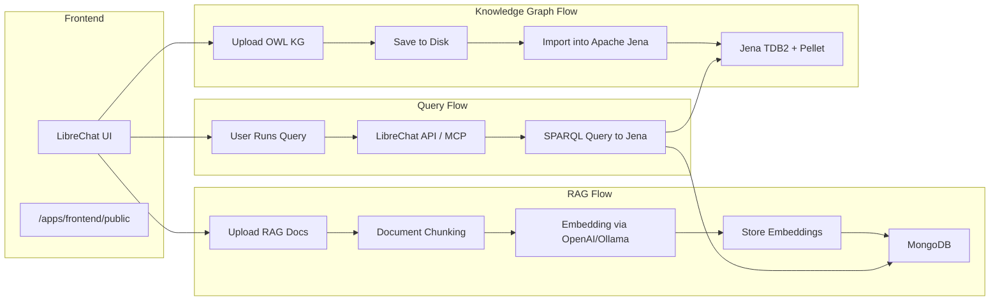

# 🧠 UltraRAG Architecture & System Guide

Welcome to the UltraRAG system overview. This guide explains the architecture, key data flows, and how to interact with the system from both a user and developer perspective.

---

## 📊 System Architecture (Mermaid Diagram)



---

## 📘 How the System Works

### 1️⃣ Uploading OWL Knowledge Graphs

**Steps:**
- User clicks "Upload OWL Graph" from the LibreChat UI (static HTML page)
- FastAPI backend handles the upload via `/upload_owl`
- File is saved to `/tmp/` or a mounted volume
- Optionally, FastAPI pushes this file to **Apache Jena Fuseki** using its SPARQL HTTP API:
  ```http
  POST http://jena-fuseki:3030/dataset/data
  Content-Type: application/rdf+xml
  ```

**Storage:** Apache Jena **TDB2** (disk-based, persistent)  
**Reasoning:** Handled by **Pellet** reasoner for OWL2 inference

---

### 2️⃣ Uploading and Embedding RAG Documents

**Steps:**
- User uploads PDFs, text, etc. from the LibreChat chat UI
- Files are processed in `rag_api` using LangChain loaders
- Chunks are embedded using **OpenAI** or **Ollama**
- Embeddings are stored in:
  - **MongoDB** (LibreChat default backend)
  - Optionally **PGVector** if enabled later

**Embedding Provider:** Configurable (OpenAI or Ollama)  
**RAG Storage:** MongoDB with metadata indexed for search

---

### 3️⃣ Running SPARQL Queries via API

**Options:**
- Users submit SPARQL queries via LibreChat UI or API prompt
- The MCP agent layer interprets intent and triggers a backend call:
  ```bash
  POST /jena/query
  Content-Type: application/sparql-query
  ```

**Backend:**
- Jena Fuseki handles SPARQL parsing, executes over TDB2 dataset
- Reasoning via Pellet allows inference over class/property hierarchies

**Hybrid Results (Future):**
- Results from SPARQL + vector search merged into a unified LLM prompt

---

## 🧩 Stack Summary

| Layer         | Tech                          |
|---------------|-------------------------------|
| UI            | LibreChat (React / HTML)      |
| RAG Embedding | LangChain + OpenAI/Ollama     |
| Storage       | MongoDB (LibreChat)           |
| KG Store      | Apache Jena TDB2              |
| Reasoning     | Pellet OWL2 Reasoner          |
| Vector Store  | (Planned) PGVector + PostgreSQL |
| SPARQL API    | Apache Jena Fuseki            |
| Agent Layer   | LibreChat MCP + FastAPI       |

---

## 📥 Data Upload Endpoints

| Endpoint        | Description                      |
|------------------|----------------------------------|
| `/upload_owl`    | Uploads OWL files to Jena store |
| `/upload`        | (Commented) SHA256 file checker |
| `/health`        | Health check endpoint           |

---

## 📌 Dev Setup Quick Start

```bash
docker-compose -f docker-compose.ultrarag.yml -f docker-compose.override.yml up --build
```

Visit: `http://localhost:8010/`

---

