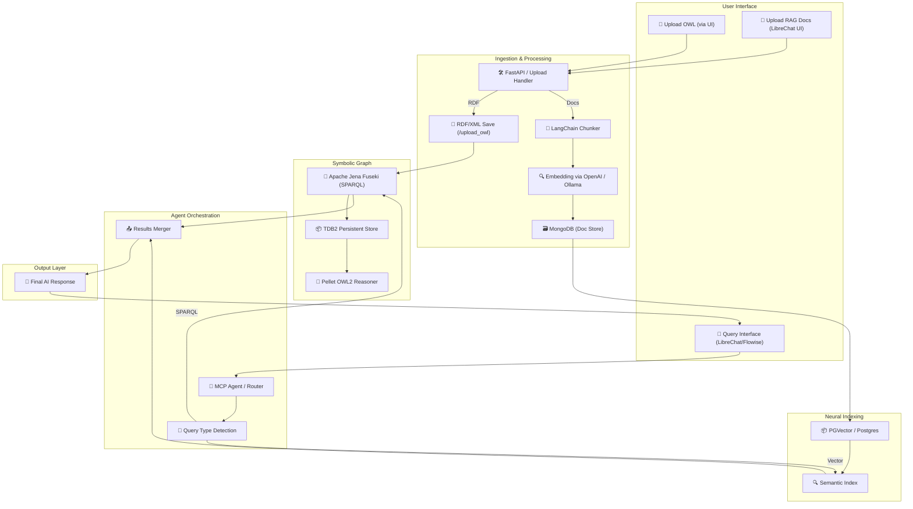

```mermaid
flowchart TD
  subgraph UI_Layer[User Interface]
    A1["📄 Upload OWL (via UI)"]
    A2["📄 Upload RAG Docs (LibreChat UI)"]
    A3["🧠 Query Interface (LibreChat/Flowise)"]
  end

  subgraph Ingestion_Pipeline[Ingestion & Processing]
    B1["🛠 FastAPI / Upload Handler"]
    B2["🧩 RDF/XML Save (/upload_owl)"]
    B3["🧠 LangChain Chunker"]
    B4["🔍 Embedding via OpenAI / Ollama"]
    B5["🗃 MongoDB (Doc Store)"]
  end

  subgraph Knowledge_Graph[Symbolic Graph]
    C1["📘 Apache Jena Fuseki (SPARQL)"]
    C2["📦 TDB2 Persistent Store"]
    C3["🧠 Pellet OWL2 Reasoner"]
  end

  subgraph Vector_DB[Neural Indexing]
    D1["📦 PGVector / Postgres"]
    D2["🔍 Semantic Index"]
  end

  subgraph Agent_Layer[Agent Orchestration]
    E1["🧠 MCP Agent / Router"]
    E2["🧪 Query Type Detection"]
    E3["📤 Results Merger"]
  end

  subgraph Output[Output Layer]
    F1["🧠 Final AI Response"]
  end

  %% UI to ingestion
  A1 --> B1
  A2 --> B1
  B1 -->|RDF| B2 --> C1
  B1 -->|Docs| B3 --> B4 --> B5 --> D1 --> D2

  %% UI to query
  A3 --> E1 --> E2
  E2 -->|SPARQL| C1
  E2 -->|Vector| D2

  %% Reasoning and merge
  C1 --> C2 --> C3
  D2 --> E3
  C1 --> E3
  E3 --> F1
  F1 --> A3
```
